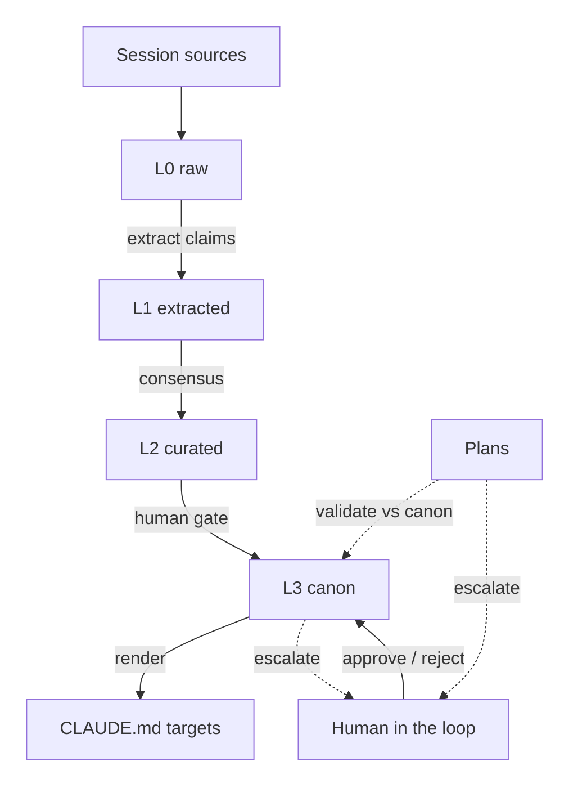
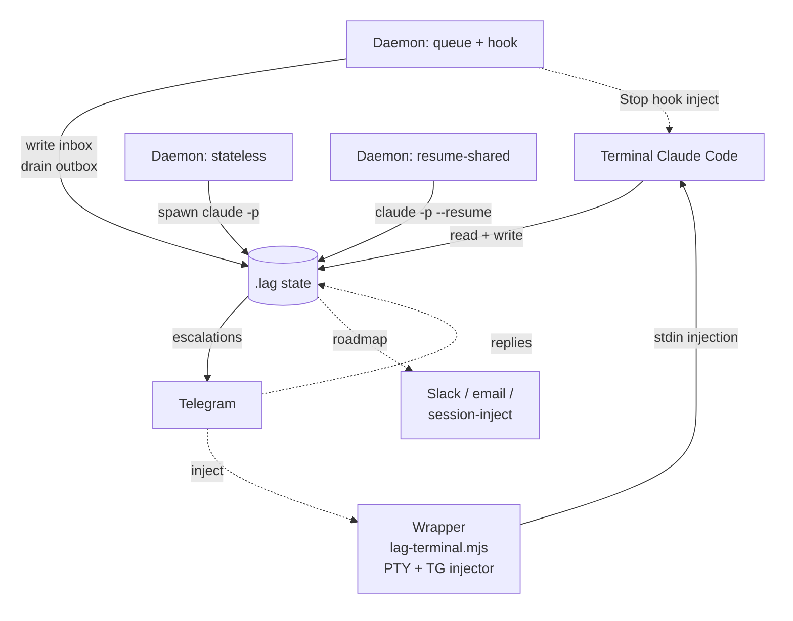

<p align="center">
  
</p>

# LAG: Layered Autonomous Governance

**The governance substrate for autonomous agent organizations. Memory is the foundation.**

A framework for multi-agent systems where memory has to stay true over time, authority has to cascade through a hierarchy, disagreements have to resolve without a human in every write, and humans stay in the loop for anything consequential. Built for **autonomous organizations of agents**, not one-shot chatbots.

> **If RAG brings knowledge into an agent, LAG governs knowledge across agents.** Retrieval makes one agent smarter; governance keeps a hundred agents coherent.

**Live demo:** [stephengardner.github.io/layered-autonomous-governance](https://stephengardner.github.io/layered-autonomous-governance/) - the LAG Console rendered against a fictional autonomous AI research collective ("Helix Collective" building "Cuttlefish", a self-modifying compiler whose agents rewrite their own optimization passes under a formal-proof + kill-switch-adjacency fence). The demo atoms/principals/plans are synthetic so the substrate can be explored without any real-org context leaking in.

Node 22+. TypeScript. Three host adapters, five operator surfaces (terminal, three daemon modes, hook-attached), three embedders, pluggable session sources, a canon-driven tool-use policy primitive, an Actor primitive for governed outward-acting agents, an inbox V1 for actor-to-actor messaging with sub-actor delegation, per-role GitHub App bot identities (operator-proxy + decision-bearing + CR-handling), and an operator-escalation channel so silent halts ping the operator instead of dying in a CI log. **1,363 unit tests + 30 gated integration tests** (count grows as open PRs land), GitHub Actions CI on Ubuntu + Windows.

---

## The problem

Once memory lives longer than a single session and spans more than one agent, it rots. Three named failure modes:

1. **Stale decisions.** A decision made last month does not surface this week. Retrieval returns similar text, not the authoritative version. The decision gets re-litigated.
2. **Unmarked reversals.** Someone (user or agent) changed their mind. The old opinion still surfaces three months later, as confidently as the new one, because nothing marked it superseded.
3. **Silent poison.** A hallucination or a write from a compromised agent reinforces itself via later turns ("we established X"). By the time anyone notices, the lineage is tangled and the clean-up is manual.

These are **governance** problems, not retrieval problems. Any vector store can return similar text. The hard part is knowing which memory is still true, who said it, what supersedes what, what to do when two sources disagree, and what to do when one of them turns out to have been compromised.

Current agentic memory systems (MemGPT, Letta, GraphRAG, Anthropic Projects) each solve one slice. None solve the governance problem.

## The solution

LAG treats memory as a governed substrate. Every stored unit is an **atom** with provenance, confidence, layer, principal, and scope. The framework applies six deterministic primitives on top, with a human in the loop as the ultimate arbiter:

- **Layered promotion**: atoms flow upward through four trust tiers (L0 raw, L1 extracted, L2 curated, L3 canon) gated by confidence x consensus x validation thresholds. Promotion creates a new atom at the target layer with `provenance.kind='canon-promoted'` and marks the source superseded. Rollback is a graph operation, not a mutation.
- **Arbitration at write time**: when two atoms conflict, a deterministic rule stack resolves before either reaches retrieval. Source-rank (layer x provenance x **principal hierarchy depth** x confidence) comes first, then temporal-scope, then validator registry, then escalation to a human. Most conflicts never reach a human.
- **Intent governance via Plans**: plans are atoms with `type: 'plan'` and a `plan_state` state machine (proposed → approved → executing → succeeded | failed | abandoned). `validatePlan()` runs a plan's content through the arbitration stack against L3 canon BEFORE execution; conflicts block or escalate. Outcome atoms tagged `derived_from: [plan_id]` preserve lineage from intent to result.
- **HIL causality via Questions**: questions are atoms with `type: 'question'` and a lifecycle (pending → answered | expired | abandoned). `askQuestion()` creates a pending-Q atom; `bindAnswer()` writes the answer as an atom with `derived_from: [question_id]` so every Q-A pair has an audit-grade causal link. Free-form Telegram replies auto-bind to the pending question they reply to, eliminating the "which question did you answer" race.
- **Tool-use policy (the autonomy dial)**: L3 canon atoms carry a `metadata.policy` object that `checkToolPolicy(host, ctx)` matches against every proposed tool call. Match scoring is exact > regex > wildcard per field (tool/origin/principal); highest specificity wins. Decisions are `allow | deny | escalate`. The policy layer sits above Claude Code's permission mode; it is canon-driven, so the autonomy dial is data, not code.
- **Actors for outward effects**: an `Actor` is a governed autonomous loop (observe → classify → propose → apply → reflect, MAPE-K lineage). `runActor` drives it with kill-switch, budget, convergence guard, and per-action policy gating via `checkToolPolicy`. Actors compose with a `Host` (governance primitives) and an actor-scoped set of `ActorAdapter`s (external systems). The Actor / Host split is a deliberate two-seam model (see D17): `Host` stays the governance boundary; `ActorAdapter` is the external-effect boundary.
- **Decay and expiration**: atoms lose confidence on a per-type half-life without reinforcement. Atoms with `expires_at` past now move to `taint='quarantined'`. Stale and expired atoms drop out of retrieval, canon, and promotion automatically.
- **Taint propagation**: when a principal is marked compromised, `propagateCompromiseTaint` walks their atoms and every derived atom across `provenance.derived_from` chains to fixpoint. The canon re-renders without the poisoned subgraph on the next tick.
- **Canon with a human gate**: L3 atoms render into a bracketed section of target `CLAUDE.md` files via `CanonMdManager`. Multi-target canon: one file per scope or role (org-wide, per-project, per-team, per-agent). L3 promotion telegraphs through the `Notifier` for human approval (or auto-approves at higher autonomy levels). Human edits outside the markers are preserved byte-for-byte.

## How it works

### The substrate (what LAG governs)

A single linear pipeline from session sources to rendered canon, with plans feeding intent governance and a human-in-the-loop gate on the L3 boundary.



Around that pipeline, governance primitives run on every loop tick: **arbitrate at write time** (detect > source-rank > temporal > validate > escalate), **promote by consensus + confidence**, **decay + TTL expire**, **taint cascade** on compromise, **validate plan** before execution. Every transition is audit-logged. Nothing is deleted.

### Runtime surfaces (how LAG is driven)

Three daemon modes plus the terminal Claude Code instance all share the same `.lag/` substrate. Pick one per context, or run them concurrently.



- **Terminal** for head-down development.
- **Wrapper (`npm run terminal` / `terminal:auto`)** launches Claude Code inside a node-pty with an embedded Telegram long-poller. Incoming TG messages inject directly into the live stdin for real-time bidirectional sessions, no turn-boundary wait. Ideal for "I want my phone to act as me."
- **Stateless daemon** for autonomous-org (each message independent, no context coupling).
- **Resume-shared daemon** for solo dev (daemon appends to your terminal's jsonl; bidirectional).
- **Queue + hook** for "terminal is brain, Telegram is mouth" (the running Claude Code instance answers Telegram via a Stop hook).

Every atom carries an audit-ready provenance chain. Every transition (promote, supersede, taint, expire, approve, reject) is logged. Nothing gets deleted; superseded atoms stay in the store with `superseded_by` set so history is reconstructible.

## Human in the loop

The deterministic rule stack resolves what it can. Everything else telegraphs a human. The `Notifier` interface makes the channel pluggable; at V0 the channel is a file queue and `lag-respond` is the interactive CLI:

```
$ lag-respond --root-dir ~/.lag/state
----------------------------------------------------------------
Handle:       4d8b8aaa76ef...15f
Kind:         proposal
Summary:      Promote seed_postgres to L3
Atom refs:    seed_postgres
Body:
  Candidate content: Use Postgres as the canonical production database.
  Consensus: 3 principals
  Validation: unverifiable
----------------------------------------------------------------
Disposition [a]pprove / [r]eject / [i]gnore / [s]kip / [q]uit: a
Responded: approve.
```

**Telegram ships today as the first non-default channel** (`src/adapters/notifier/telegram.ts`). It wraps a base `FileNotifier`, forwards the same escalation to your phone with an inline keyboard (Approve / Reject / Ignore), and polls `getUpdates` for callback responses. If Telegram is unreachable, the base notifier keeps working; governance degrades gracefully. Wire in ~15 lines:

```ts
import { createFileHost } from 'layered-autonomous-governance/adapters/file';
import { TelegramNotifier } from 'layered-autonomous-governance/adapters/notifier';

const host = await createFileHost({ rootDir: '.lag' });
const telegram = new TelegramNotifier({
  botToken: process.env.TELEGRAM_BOT_TOKEN!,
  chatId: process.env.TELEGRAM_CHAT_ID!,
  base: host.notifier,
  respondAsPrincipal: 'stephen' as PrincipalId,
});
telegram.startPolling(); // poll getUpdates every 2s for responses
// Compose: use `telegram` wherever you'd use `host.notifier`.
```

Remaining on the roadmap: **Slack** (channel + action buttons), **Claude Code session-inject** (pending reviews appear in the next session's context), **email** (daily digest + individual escalations). All ride the same seam as Telegram. The human is the source of truth for anything the deterministic stack cannot decide; the autonomy dial controls how often that happens.

---

## Who this is for

- **An autonomous organization of agents** with persistent roles, shared memory, and governance that runs without a human in every write. Principal hierarchy (via `signed_by`), consensus-based promotion, compromise cascade, and the full audit trail are the primitives. The autonomy dial moves from "human approves every L3" to "human sees only escalations" without rewriting architecture; you move config, not code.
- **A team of agents on a shared codebase**, where two agents will inevitably disagree and neither should silently win.
- **A per-user agent that lives across weeks**, where a session next month should remember decisions from today without the user re-explaining.
- **A long-running autonomous research process**, where one hallucination today becomes tomorrow's "established fact" unless something is checking.
- **A curated knowledge base** (compliance, security reviews, customer memory) where audit and rollback matter as much as retrieval.

If you want a drop-in RAG setup for a chatbot that forgets between sessions, LAG is overkill. Use a plain vector store.

## Applications (concrete shapes)

- **Autonomous agent organization.** Each agent is a principal with a defined role, signed by a parent principal up to a root. Agents operate on shared L1/L2 atoms under scope + layer permissions; consensus across agents promotes atoms upward automatically; L3 changes telegraph per the autonomy dial. Disagreements resolve via the arbitration stack without waking a human unless the stack cannot decide. When a principal is compromised, `lag-compromise` cascades taint across every derived atom and canon re-renders without the poisoned subgraph. The audit log reconstructs every decision for retrospective review.
- **Question → Plan → PR substrate (CTO half wired, CodeAuthor half in progress).** The `cto-actor` Principal runs a PlanningActor with an LLM-backed judgment that deliberates against L3 canon and produces a Plan atom with citation-rich provenance and the originating Question's verbatim body propagated through `metadata.question_prompt`. A `draftCodeChange` primitive + `createAppBackedGhClient` can turn that Plan into a signed PR under a per-role GitHub App identity. The standalone `CodeAuthorActor` loop that ties plan-pickup + drafter + PR creation together is currently a skeleton (fence validation only); closing that wiring is a tracked follow-up. `PrLandingActor` already observes review state and merges when CI + CodeRabbit approval + required status all land. Walkthrough with atom shapes, debugging checklist, and an honest implementation-status table: [`docs/autonomous-org-walkthrough.md`](docs/autonomous-org-walkthrough.md).
- **Bootstrapping from an external vector store.** The bridge adapter ingests drawers from an existing [mempalace](https://pypi.org/project/mempalace/)-style ChromaDB store as L1 observations. Your external store stays authoritative for raw vector retrieval; LAG layers governance (promotion, arbitration, canon writing, audit) on top.
- **Cross-session agent memory.** Each session ingests transcripts into L1 as observations; consensus across sessions lifts content to L2; the L3 human gate writes the canonical bits into your project's `CLAUDE.md`. Stale observations decay; reversals supersede. Covered by `examples/quickstart.mjs` at small scale and `test/integration/bridge-live-flow.test.ts` end-to-end.
- **Multi-agent coordination on a monorepo.** Each agent is a principal with its own `permitted_scopes` and `permitted_layers`. Agreements form consensus and promote automatically; disagreements arbitrate; escalations telegraph for operator review via `lag-respond`.
- **Operator incident response.** When a principal is compromised, `lag-compromise --principal <id>` propagates taint across every direct and derived atom and re-renders canon without the poisoned subgraph.

---

## Quick start

```bash
npm install
npm run build
node examples/quickstart.mjs
```

That script spins up a memory-backed Host, seeds three atoms from three principals, searches them, runs a promotion pass to elevate the consensus into the L2 curated layer, and prints the resulting state plus audit log. About 90 user-facing lines.

## Library shape

Two kinds of imports: **top-level** for the everyday governance primitives, **sub-paths** for heavier or opt-in modules so nothing is paid for unless you use it.

Host factories (sub-paths):

```ts
import { createMemoryHost } from 'layered-autonomous-governance/adapters/memory';
import { createFileHost }   from 'layered-autonomous-governance/adapters/file';
import { createBridgeHost } from 'layered-autonomous-governance/adapters/bridge';
import { TelegramNotifier } from 'layered-autonomous-governance/adapters/notifier';
```

Actors and external-system adapters (sub-paths; outward-acting work is opt-in):

```ts
import { runActor } from 'layered-autonomous-governance/actors';
import { PrLandingActor } from 'layered-autonomous-governance/actors/pr-landing';
import { GitHubPrReviewAdapter } from 'layered-autonomous-governance/actors/pr-review';
import { createGhClient } from 'layered-autonomous-governance/external/github';

// Actor-to-actor messaging (Inbox V1): write-time rate limiter, circuit
// breaker, pickup handler, hybrid-wake seam, sub-actor registry,
// auditor, plan-dispatch loop, auto-approve pass. See
// `arch-actor-message-inbox-primitive` in canon for the design decision.
import {
  ActorMessageRateLimiter,
  pickNextMessage,
  runInboxPoller,
  SubActorRegistry,
  runAuditor,
  runDispatchTick,
  runAutoApprovePass,
  validateResetWrite,
} from 'layered-autonomous-governance/actor-message';

// Per-role GitHub App identity + pluggable auth (see "Actor identities" below):
import {
  loadRoleRegistry,
  createCredentialsStore,
  provisionRole,
} from 'layered-autonomous-governance/actors/provisioning';
import { createAppBackedGhClient } from 'layered-autonomous-governance/external/github-app';
```

Everyday governance primitives (top-level):

```ts
import {
  LoopRunner, PromotionEngine,
  arbitrate, applyDecision, computePrincipalDepth,
  propagateCompromiseTaint, CanonMdManager,
  checkToolPolicy, askQuestion, bindAnswer,
  validatePlan, executePlan,
  TrigramEmbedder, CachingEmbedder, OnnxMiniLmEmbedder,
} from 'layered-autonomous-governance';
import type { Host, Atom, AtomId, PrincipalId } from 'layered-autonomous-governance';
```

## CLIs and runtime surfaces

Operator commands ship as npm bins:

- `lag-run-loop` - autonomous tick daemon. Walks decay, TTL expiration, L2 promotion, L3 promotion (with human gate), canon file applier.
- `lag-respond` - interactive human-approval prompt. Displays pending notifications; accepts approve/reject/ignore/skip/quit via stdin.
- `lag-compromise` - operator incident response. Marks a principal compromised, propagates taint across direct and derived atoms, prints the affected atom ids and an audit summary.
- `lag-actors` - per-role GitHub App identity provisioning. `sync` walks `roles.json` and creates one App per un-provisioned actor (browser-approval flow, one click per role). `list` enumerates provisioned actors and their `<slug>[bot]` identities. `demo-pr` and `demo-adapter` exercise the full auth chain end-to-end. See "Actor identities" below.

Runnable scripts (no install):

- `node scripts/bootstrap.mjs` - self-bootstrap. Seeds a curated set of L3 invariants as atoms from a root principal and renders them into `CLAUDE.md`. This repo's own `CLAUDE.md` is produced by this script against LAG's own substrate.
- `node scripts/ingest.mjs --source <kind>:<path>` - compose one or more `SessionSource`s to pre-populate `.lag/` from existing history (Claude Code transcripts today; Obsidian / Git / Slack / ChromaDB on the roadmap).
- `node scripts/daemon.mjs [--queue-only | --resume-session <id> | --resume-latest]` - the Telegram-facing daemon with three runtime modes:
  - default (stateless): each message spawns a fresh `claude -p`; best for autonomous-org setups.
  - `--resume-session <id>` / `--resume-latest`: each message resumes a specific session via claude-cli's `--resume` flag; replies append to the shared jsonl so a terminal Claude Code session sees them on its next turn.
  - `--queue-only`: daemon becomes a pure transport (write inbox, drain outbox). Pair with the `examples/hooks/lag-tg-attached-stop.cjs` Stop hook to have the *running* terminal Claude Code instance answer Telegram directly, bidirectional.
- `node scripts/telegram-whoami.mjs` - helper to discover your Telegram chat id after you message your bot.

All three CLI bins accept `--help`; scripts are documented in their headers.

## Adapters

Two kinds of adapter seam, kept deliberately separate (see DECISIONS.md D1 and D17):

### Host adapters (governance boundary)

Three Host implementations all satisfying the same 8-interface Host contract (AtomStore, CanonStore, LLM, Notifier, Scheduler, Auditor, PrincipalStore, Clock):

- **memory** - in-process, deterministic, zero-dep. Used for tests and quick scripts.
- **file** - JSON files + atomic tmp+rename writes under `rootDir/`. Cross-session: two Host processes at the same rootDir observe each other through the filesystem.
- **bridge** - wraps `file` and adds a Python subprocess bridge to bootstrap an existing ChromaDB-backed vector store as L1 atoms. Composes with a Claude CLI LLM via OAuth (no API key).

Adding a fourth adapter (remote, postgres, custom vector store) is a factory plus six conformance-spec invocations.

### Actor adapters (external-effect boundary)

Actors are outward-acting autonomous loops; the things they touch (GitHub, CI, deploy targets) are `ActorAdapter`s rather than Host sub-interfaces. This keeps Host focused on governance and lets Actor dependencies stay self-declared at the type level. Shipped today:

- **`external/github` -> `GhClient`** - reusable GitHub transport primitive (typed REST + GraphQL over the `gh` CLI, PAT-authenticated). Any Actor that touches GitHub builds on this single client.
- **`external/github-app` -> `createAppBackedGhClient`** - the same `GhClient` shape, but backed by a provisioned GitHub App installation (JWT + installation token over HTTP, no `gh` CLI). Same Actor code; auth backend is a caller choice (see D19 in DECISIONS.md).
- **`actors/pr-review` -> `GitHubPrReviewAdapter`** - full `PrReviewAdapter` implementation (GraphQL review threads, REST reply, GraphQL resolve mutation, first-class dry-run). Accepts either `GhClient` implementation unchanged.
- **`actors/provisioning`** - declarative role schema + provisioning orchestrator for per-Actor App identities. See "Actor identities" below.
- **`actor-message` -> inbox V1** - inter-actor coordination as memory governance. Every message between actors is an atom, so messages inherit arbitration, taint propagation, decay, and the canon-driven policy layer for free; coordination is not a second substrate. On top of that atom shape: write-time rate limiter + circuit breaker, pickup handler with kill-switch and canon-tunable ordering, hybrid-wake seam (poll or NOTIFY), SubActorRegistry for plan-dispatch, AuditorActor, and a low-stakes auto-approval pass. See `arch-actor-message-inbox-primitive` in canon and `docs/bot-identities.md` for how this composes with the bot-identity model below.

## Actor identities

Two kinds of identity an Actor can wear on GitHub. The framework supports both; the deployment chooses per Actor.

**PAT identity (default, zero-setup):** the operator's personal access token, via `createGhClient()`. PRs, reviews, and comments opened by any Actor appear as the operator's user. Fine for solo projects and local dev; the human IS the accountability trail.

**App identity (per-role, for autonomous orgs):** a dedicated GitHub App per Actor role, via `createAppBackedGhClient({ auth })`. PRs from `PrLandingActor` appear as `lag-pr-landing[bot]`; a future `CtoActor` appears as `lag-cto[bot]`; etc. Each role has its own credentials, its own permission set, its own revocation boundary. The framework treats role names as opaque; you pick the ones that fit your org shape.

The choice is pluggable. Wire whichever client into `GitHubPrReviewAdapter`; the Actor code never changes:

```ts
// Load credentials a role provisioned by `lag-actors sync`. The
// store reads .lag/apps/<role>.json + .lag/apps/keys/<role>.pem;
// installationId is populated after the App is installed on a
// target. See `actors/provisioning` for the full surface.
async function ghClientForRole(role: string) {
  const store = createCredentialsStore('.lag');
  const loaded = await store.load(role);
  if (!loaded) {
    throw new Error(`role "${role}" not provisioned; run 'lag-actors sync'`);
  }
  if (loaded.record.installationId === undefined) {
    throw new Error(`role "${role}" has no installation; install the App on a target repo first`);
  }
  return createAppBackedGhClient({
    auth: {
      appId: loaded.record.appId,
      installationId: loaded.record.installationId,
      privateKey: loaded.privateKey,
    },
  });
}

// Same actor, different identity on the wire:
const client = useBotIdentity
  ? await ghClientForRole('lag-pr-landing')
  : createGhClient();

const actor = new PrLandingActor({
  adapter: new GitHubPrReviewAdapter({ client }),
});
```

### Declaring roles

Actor identities are declared, not coded. Drop a `roles.json` at your project root:

```json
{
  "version": 1,
  "actors": [
    {
      "name": "lag-pr-landing",
      "displayName": "LAG PR Landing",
      "description": "Lands PRs from review feedback.",
      "permissions": {
        "contents": "write",
        "pull_requests": "write",
        "checks": "read",
        "statuses": "read",
        "metadata": "read"
      }
    }
  ]
}
```

### Provisioning

`lag-actors sync` walks the registry and provisions any un-provisioned role:

```text
$ lag-actors sync
[lag-pr-landing] risk=high: contents:write allows direct commits
[lag-pr-landing] awaiting operator approval...
[lag-pr-landing] callback listening at http://127.0.0.1:56324/callback
[lag-pr-landing] open in browser: http://127.0.0.1:56324/start
  (browser opens; operator clicks "Create GitHub App"; one click per role)
[lag-pr-landing] provisioned as lag-pr-landing[bot] (app id 3437485)
```

Under the hood: localhost callback server binds a random port; generates a GitHub App Manifest with the role's declared permissions; operator's browser is pointed at a local `/start` page that POSTs the manifest to GitHub; operator clicks Create; GitHub redirects to the local `/callback`; LAG exchanges the returned code for the new App's private key and writes `.lag/apps/<role>.json` + `.lag/apps/keys/<role>.pem` (chmod 0600, gitignored).

**High-risk roles** (anything asking for `contents:write`, `workflows:write`, or `administration`) gate on operator approval before the browser ever opens. The default is a terminal y/N prompt; swap in a Telegram notifier for remote approval.

After provisioning, the App still needs to be installed on the target repos (one more browser click per repo). `lag-actors demo-pr --role lag-pr-landing --repo <owner>/<repo>` validates the full chain by opening a trivial test PR as the bot.

### Runtime use from session scripts

Two thin wrappers route any `gh` CLI call through a provisioned bot identity, so session automation operates as `lag-ceo[bot]` / `lag-cto[bot]` / `lag-pr-landing[bot]` / etc. instead of under the operator's personal `gh auth`:

```bash
# Wrap a gh command under a bot identity (operator-proxy):
node scripts/gh-as.mjs lag-ceo pr create --title "feat: ..." --body "..."

# Or decision-bearing authorship when a CTO-authored plan opens the PR:
node scripts/gh-as.mjs lag-cto pr merge 123 --squash

# Or mint a bare installation token for non-gh consumers:
GH_TOKEN=$(node scripts/gh-token-for.mjs lag-ceo) gh api ...
```

Tokens are short-lived (~1 hour per GitHub), minted fresh per invocation, set in a child process env only, never written to disk. Parent shell `gh auth` state is untouched.

**Three layers give a deterministic repo-scoped guarantee** that agent-produced GitHub artifacts never carry the operator's personal login: credential isolation (per-repo `.lag/apps/<role>.*`), repo-local git identity (`git config --local user.email <APP-ID>+<role>[bot]@users.noreply.github.com`), and a PreToolUse hook (`.claude/hooks/enforce-lag-ceo-for-gh.mjs`, wired in `.claude/settings.json`) that blocks raw `gh` calls in a Claude Code session in this repo and routes them through `gh-as.mjs`. Full operator guide + the enforcement invariant: `docs/bot-identities.md`.

### Why one App per role (not one shared App)

Per D18 in DECISIONS.md: GitHub surfaces one identity per App (`<slug>[bot]`); sharing one App across roles collapses the audit trail, forces the union of every role's permissions, and makes revocation all-or-nothing. One App per role keeps each identity distinctly attributable on every timeline event, each permission set minimal, and each revocation surgical. The one-time provisioning cost (a browser click per new role) buys that every action from that role is forever clearly labeled.

### Why auth is pluggable (not App-only)

Per D19: forcing bot-only closes the door on zero-setup onboarding and breaks every consumer who just wants to paste a PAT and run. Forcing human-only strands the provisioning investment and forfeits per-role audit. Pluggability lets the same Actor graduate with the deployment: start on PAT, adopt role bots when the org grows, without a rewrite.

## Embedders

Three pluggable embedders behind a single `Embedder` interface:

- **TrigramEmbedder** (default): FNV-hashed character trigrams into 128-dim + L2 normalize + cosine. Zero deps, deterministic, fast. Handles exact / rearranged / synonym / paraphrase / adversarial queries at 0.95+ top-1; collapses to 0.20 on pure-semantic paraphrase.
- **OnnxMiniLmEmbedder**: local `Xenova/all-MiniLM-L6-v2` via `@huggingface/transformers`. 384-dim. Private, offline after first-run model download, MIT license. Lifts hard-paraphrase top-1 from 0.20 to 0.60 (3x).
- **CachingEmbedder**: decorator. Persists vectors to `rootDir/embed-cache/<embedderId>/<sha>.json`. Turns first-query cost from O(N) embeds to O(N) disk reads. Measured 17x speedup on 200 atoms in isolation.

## Principles (settled)

1. **Governance before autonomy.** Build the rules, then tune the knobs. Not reverse.
2. **Provenance on every write.** No atom without a source chain. It pays back everything hard later.
3. **Conflict detection at write time.** Optimal regardless of cost. Nightly batch is always too late.
4. **Skeptical bootstrap.** Trust is earned over sessions, not granted.
5. **Testable via simulation.** Ground-truth oracle, self-play loops. If it cannot self-bootstrap from its own design conversation, it does not work.
6. **Design the kill switch first.** Before the autonomy dial moves.

## Tests + CI

```
npm test                                                                                        # 568+ passed, 30 gated
LAG_SPAWN_TEST=1 LAG_REAL_CLI=1 LAG_REAL_PALACE=1 LAG_BENCH_SCALE=1 LAG_REAL_EMBED=1 npm test   # full matrix
```

Default suite runs in ~10s across the Host interfaces, scenarios s1-s10 (self-bootstrap, decision reversal, promotion, TTL, collusion, compromise, hierarchy, self-bootstrap canon render, plan governance, source composition), arbitration stack (including hierarchy-aware source-rank), promotion engine, plan validation + state machine, loop runner, canon manager (single- and multi-target), taint propagator, session sources, daemon + format conversion, Telegram notifier with mocked fetch, and every adapter's conformance spec. Gated suites need the ONNX model, a ChromaDB Python bridge, subprocess spawns, or a real Claude CLI; they run under env flags.

GitHub Actions CI runs typecheck, build, default test suite, and a quickstart smoke on Node 22 across Ubuntu and Windows for every push and PR to `main`. A separate package-hygiene job verifies no private-term leaks and no emdashes in prose.

## How to read this repo

1. `docs/core-use-case.md` - the narrow V0 target and acceptance criteria.
2. `docs/framework.md` - the overall model (layers, atoms, lifecycle, arbitration, retrieval).
3. `docs/glossary.md` - terminology, one glance.
4. `examples/quickstart.mjs` - a runnable demonstration.
5. `design/target-architecture.md` - the north-star diagram with gap analysis and a leverage-ordered roadmap.
6. `design/host-interface.md` - the 8-interface Host contract every adapter satisfies.
7. `design/actors-and-adapters.md` - the Actor / ActorAdapter shape and the D1-to-D17 boundary-narrowing rationale.
8. `design/prior-art-actor-frameworks.md` - shape survey of LangGraph / CrewAI / Mastra / Autogen / AI SDK / Pydantic AI; where LAG aligns and where it deliberately differs.
9. `design/structural-audit-2026-04.md` - the last principled audit against pluggability, substrate-discipline, and simple-surface goals.
10. `DECISIONS.md` - living log of architectural choices: what we picked, why, and what we rejected.
11. `CLAUDE.md` - rendered canon (L3 atoms from this repo's own `.lag/` state). What future agents on this repo should read first.

## Non-goals (for now)

- Secrets and PII redaction. Deferred until core works.
- Multi-tenant / org-wide scope bleed. Deferred.
- Cross-machine sync. V0 is single-machine; the file adapter's cross-session primitive handles multi-process on the same machine.
- ANN index (HNSW). Linear cosine handles 10K-100K atoms after the cache warms. Revisit past 50K.
- Hosted embeddings API. Local ONNX is architecturally dominant for a self-contained memory system (private, offline, deterministic, no vendor lock).

## Related work worth studying

- MemGPT (Berkeley 2023): core/archival hierarchy.
- Letta: multi-agent shared memory, eventual consistency.
- Microsoft GraphRAG: entity + relation layer.
- Anthropic Projects: low-autonomy baseline.
- Temporal knowledge graph literature: time as first-class relationship.

## License

MIT. See `LICENSE`.
