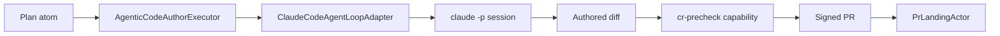

# Agentic actor loop

Three PRs landed the trilogy that turns LAG's Actor primitive into an executable agentic loop: PR1 added the substrate seams, PR2 added `AgenticCodeAuthorExecutor`, PR3 added `ClaudeCodeAgentLoopAdapter`. Together they let a Plan atom flow from intent through deliberation into a signed PR under a per-role bot identity, with each step auditable.

## The seams

## PR1 substrate

The first PR widened the Actor primitive's apply step: a stable seam for substituting an executor (default vs agentic), a hybrid wake mode so the loop reacts to inbox NOTIFY and to scheduler ticks, and capability registration around the apply step (the slot the `cr-precheck` gate plugs into).

What changed at the type level:

- `Actor.apply` now accepts a pluggable executor.
- `runActor` takes a `capabilities` registry and runs each capability against the proposed action before commit.
- The inbox pickup handler exposes `pickNextMessage` so an Actor can be driven by message arrival or by tick, indistinguishably.

## PR2 AgenticCodeAuthorExecutor

The second PR added the executor that reads a Plan atom from the inbox, propagates the originating `question_prompt` and the plan's citation chain into the executor's prompt, and emits a unified diff bound to the plan's target paths. Failures fall back to a structured `notes` field rather than a partial mutation.

The executor is opt-in: the default executor stays in place for tests and non-agentic actors. Subpath: `actor-message/executor-default` for the existing default; the agentic executor lives under `actors/code-author`.

## PR3 ClaudeCodeAgentLoopAdapter

The third PR added the adapter that runs an executor's prompt against a `claude -p` session, captures the structured tool output, and replays the result back into the inbox as a code-author response atom. The adapter is the seam between LAG (substrate, plans, atoms) and the agent runtime; per `arch-host-interface-boundary` it wears the external-effect boundary, not the governance one.

`ResumeAuthorAgentLoopAdapter` (PR6) extends this with session continuity: a long-running code-author task can resume across multiple ticks without losing prior reasoning state, by pinning the underlying session id and replaying through the adapter's `--resume` path.

## How it composes with the rest

- `PrFixActor` (PR5) consumes review feedback atoms produced by `GitHubPrReviewAdapter` and replays them through the same executor seam, so review-driven edits go through the same governed path as initial drafts.
- `PrLandingActor` watches the resulting PR and merges when CI, CodeRabbit, and required-status all land.
- The `cr-precheck` capability (PR #172) runs the CodeRabbit CLI locally on the staged diff before push, so the agentic loop satisfies the required status check pre-flight.

## Tracing a Plan into a PR

1. Operator (or `cto-actor`) writes an intent atom; the planning actor produces a Plan atom with citations.
2. Inbox dispatch routes the Plan to `code-author` (the principal authorized to mutate tracked files).
3. `AgenticCodeAuthorExecutor` runs through `ClaudeCodeAgentLoopAdapter` and emits a diff.
4. `cr-precheck` runs the CodeRabbit CLI locally; failures abort before push.
5. `code-author` opens the signed PR; `PrLandingActor` watches; `PrFixActor` handles review iterations.
6. Required status checks (Node 22 ubuntu, Node 22 windows, package hygiene, CodeRabbit) gate merge.

Every step is an atom in the substrate. Every atom is auditable. The provenance chain back to the operator's original intent atom never breaks.
